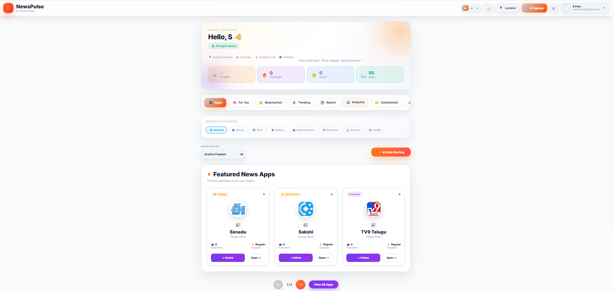
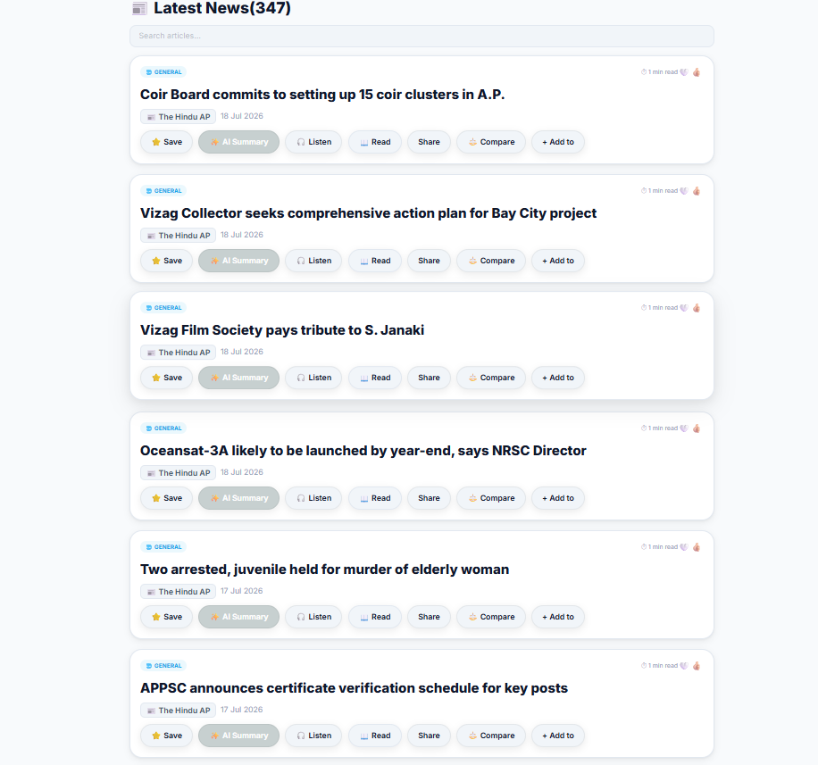
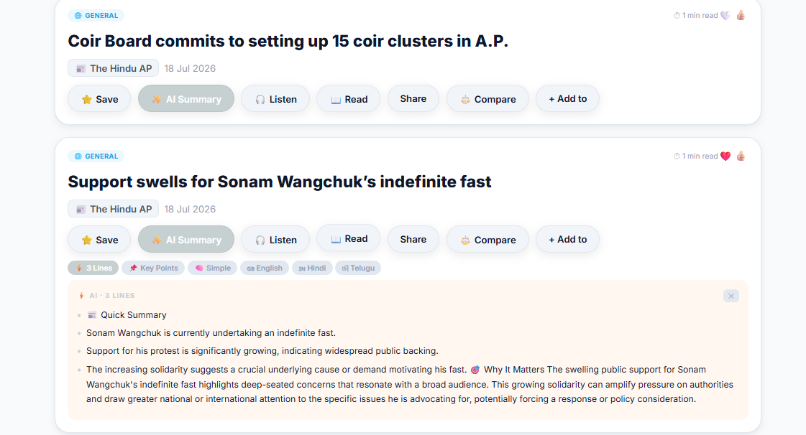

# 📰 NewsPulse

NewsPulse is an AI-powered personalized news application that delivers real-time news from multiple trusted sources with intelligent features like AI summaries, text-to-speech, bookmarking, personalized recommendations, and multilingual support.

---

## 🚀 Features

- 📰 Latest News from multiple sources
- 🤖 AI-powered News Summaries
- 🎧 Listen to Articles (Text-to-Speech)
- 📌 Save Articles
- 🔍 Compare Articles
- 📂 Organize News Collections
- ❤️ Like / Dislike Articles
- 🌍 State-wise News
- 🧠 Personalized News Feed
- 📱 Responsive UI
- 🌙 Dark & Light Mode

---

## 🛠 Tech Stack

### Frontend
- React.js
- JavaScript
- CSS
- Axios

### Backend
- Node.js
- Express.js

### Database
- MongoDB Atlas

### APIs & Services
- Firebase Authentication
- Google News RSS
- AI Summarization API
- Text-to-Speech API

---

### Frontend

```bash
cd frontend
npm install
npm start
```

### Backend

```bash
cd backend
npm install
npm start
```

---

## 🔐 Environment Variables

Create a `.env` file inside the backend folder.

---

## 📸 Screenshots

<h2>🏠Home Screen</h2>



<h2>📰 News Feed</h2>



<h2>📖 Read Article Screen</h2>


<h2>🤖 AI Summary</h2>



---

## 📄 License

This project is for educational and personal use.

---

## 👨‍💻 Developer

**S Irfan**

B.Tech Computer Science Engineering

AI & Full Stack Developer
